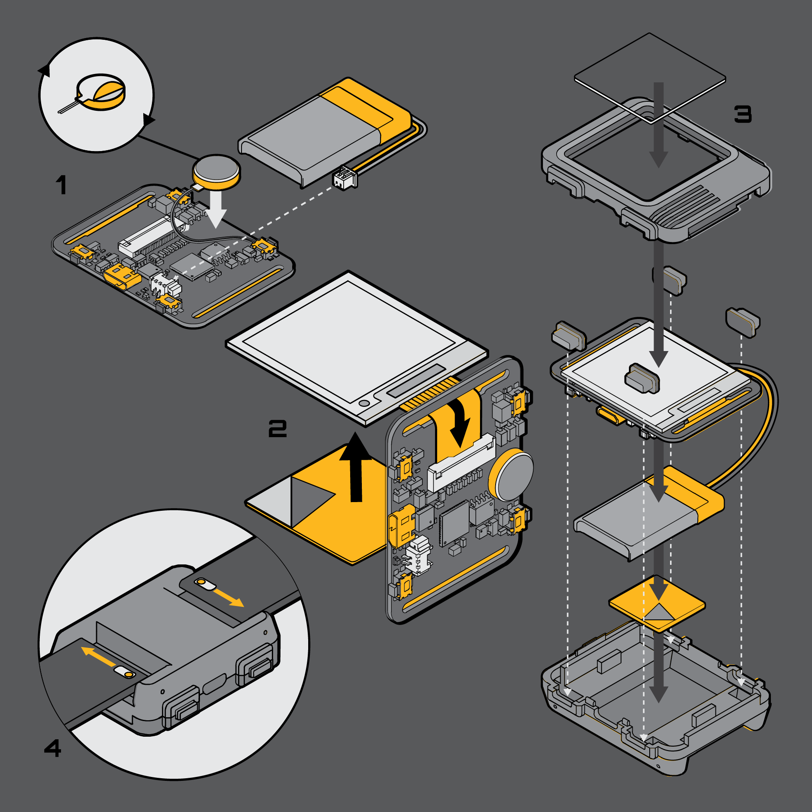
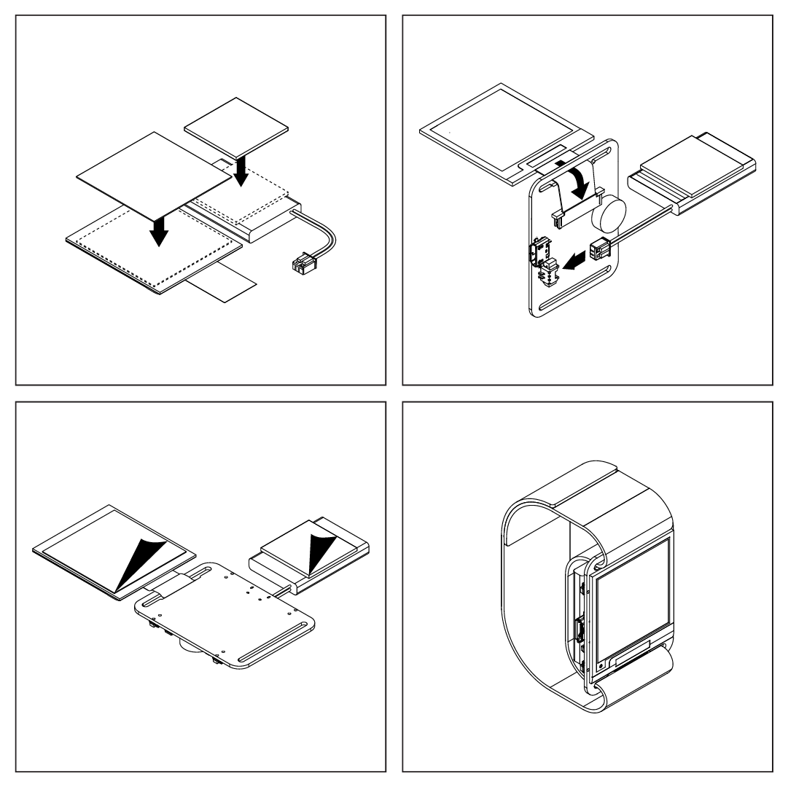

## Watchy Kit w/ Case Assembly


**Before You Begin** make sure you review the instructions and inspect for any missing or damaged components.

**Remove The Components Carefully** as they are tightly packed for maximum protection. The display is made of glass and will crack if you bend it!

**Test Your PCB** to make sure the board is functional!

**Do Not Apply The Included Tape!!** Watchy can be assembled and secured with the included enclosure, without needing any tape. Only apply the tape if you intend to use Watchy without the enclosure, and have triple checked the screen is properly aligned.

1. Connect the screen to the FPC connector, the shiny gold pins on the ribbon cable should be facing up. The ribbon cable goes through the PCB slot like in the image above.
2. Connect the battery
3. Connect the USB to start charging the battery
4. Press [SW1](/docs/hardware#bill-of-materials) to bring up the **menu**/**confirm**
5. Press [SW3](/docs/hardware#bill-of-materials) & [SW4](/docs/hardware#bill-of-materials) to navigate **up**/**down**
6. Press [SW2](/docs/hardware#bill-of-materials) to **exit/cancel**


7. Wait 1 minute to check and see if the clock is updating the time correctly

**Tips**

- **Make sure the screen is perfectly aligned before taping it down!** It should not extend above or below the strap holes on the PCB.


- **Make sure the battery cable is tucked in** Everything should fit snug and be aligned to the bottom case, before securing the top case.
- **Do NOT force the case to close. It could break the screen & buttons!** The case should close easily with the top and bottom snaps latching.
- **Do NOT overtighten the screws in the aluminum case** Overtightening will crack the screen! Make sure everything fits nicely and slowly adjust the screws to secure the case.
- **Still having trouble?** Check out this step-by-step guide on assembling the case in our [FAQ](/docs/faqs#the-case-doesnt-fitclose-how-do-i-assemble-it)

Assembly Video: https://www.youtube.com/watch?v=ftLTrr_HTpI

Assembly Video (CNC Aluminum Case): https://www.youtube.com/watch?v=rbVr9eVb72M

## Watchy Original Assembly


1. Apply tape to the **back** of the E-Paper display and battery. The **front of the display is white** and the **back of the display is metallic/silver**
2. Pull lightly to unlock the FFC connector, insert the display cable through the strap hole. Make sure the cable is inserted all the way, then push the lock back in to secure the cable. 
3. Fold back and align the display to the top of the PCB, peel off the tape and firmly secure the display
4. Insert the battery plug, ensure correct polarity (red is closer to the USB connector)
5. Peel off the tape and firmly secure the battery to the PCB
6. Insert the watch strap through the PCB strap holes, then tighten the strap from both ends
7. Wrap the strap around your arm and adjust for comfort

Assembly video: https://www.youtube.com/watch?v=PCPxTS1aF3w

## Arduino Setup

Watchy comes pre-loaded with firmware that demonstrates all the basic features. You can also try different watch faces and examples in Arduino.

1. Download and install the latest <ins>[Arduino IDE](https://www.arduino.cc/en/software)</ins>
2. Start Arduino and open the *Preferences* window.
3. Under *Additional Board Manager URLs* add:

    ```
    https://raw.githubusercontent.com/espressif/arduino-esp32/gh-pages/package_esp32_index.json
    ```
4. Open **Boards Manager** under Tools > Board menu and install the *esp32* platform (Note: there is a bug in 2.0.3, please use 2.0.2 until it is fixed)
5. Under Sketch > Include Library > Manage Libraries, search for **Watchy** and install the latest version
6. Make sure all the dependencies are updated to the latest version i.e. **GxEPD2** , **WiFiManager**, **etc.**

### Upload

1. Plug in the USB on Watchy and select the serial port that shows up
2. If nothing shows up, or if you're having trouble uploading, make sure you have the <ins>[USB-Serial drivers](https://www.silabs.com/products/development-tools/software/usb-to-uart-bridge-vcp-drivers)</ins> installed.
2. Select **ESP32 Dev Module** under Tools > Board > ESP32 Arduino
3. Select **Huge App** under Tools > Partition Scheme
4. Leave everything else as default
6. Choose an example and hit upload
7. Try modifiying the examples or create your own app!

---

## PlatformIO Setup

[PlatformIO](https://platformio.org/) is a compatible alternative to arduino. It's more oriented for the command line user, but it is also more flexible and predictable in build configurations and dependency management (like libraries).

It has two parts: a "core" that has the command line tools that build and upload/flash, and an "ide" which is a bunch of plugins and extensions for editors you can [find here](https://platformio.org/install/integration).

Use whichever extensions you wish but this documentation is related to the core, so:

- [Install with instructions here](https://docs.platformio.org/en/latest//core/installation.html).

### Simple watchface example

This example is to create a new watch face project, it starts by copying one of the examples to the `src/` folder where you can make your own. However, it will not make it easy to edit the watchy library, or its `config.h` file, which many want to, for that see the section below.

- Create a new folder and setup the PlatformIO project layout
```bash
mkdir my_new_watchy_face_project
cd my_new_watchy_face_project
pio project init --board esp32dev
```

- Add the following to the `platformio.ini` file. Note that if you want to use another version of the Watchy library, you can put any file or git path here.

:::caution

Some users have reported problems with one of the supported RTC modules: The module `PCF8563` seems to be supported during first boots, but their library is overriden by PlatformIO using a broken version - so you need to add an other repository (`https://github.com/orbitalair/Rtc_Pcf8563.git`) to prevent that.

:::

```ini
lib_deps =
    sqfmi/Watchy @ 1.4.1 ; Pinned version to ensure we don't pull broken code
    https://github.com/tzapu/WiFiManager.git#v2.0.11-beta ; Pinned for the same reason
lib_ldf_mode = deep+
board_build.partitions = min_spiffs.csv
```

- Also pin the version of platform `espressif32` to ensure compatibility.
```diff
  [env:esp32dev]
- platform = espressif32
+ platform = espressif32 @ ~3.5.0
```

- Run PlatformIO, it will download dependencies such as the Watchy library, but then fail to compile because there aren't any source files in `src/` yet. So when the dependencies are downloaded, copy the `7_SEG` example files to `src/`.
```bash
pio run # will fail compilation but will download dependencies
cp .pio/libdeps/esp32dev/Watchy/examples/WatchFaces/7_SEG/*.{ino,cpp,h} src/
```

- Plug in your watchy, compile and then upload the watch face:
```bash
pio run -t upload
```

- Watch the serial port output
```bash
pio device monitor
```

- Celebrate by watching ascii star wars
```bash
telnet towel.blinkenlights.nl
```

- Additional keys you'll probably want to add to your `platformio.ini` file:
```ini
upload_speed = 3000000
upload_port = /dev/cu.usbserial-MQK8G8
monitor_port = /dev/cu.usbserial-MQK8G8
monitor_speed = 115200
monitor_filters = esp32_exception_decoder
```
