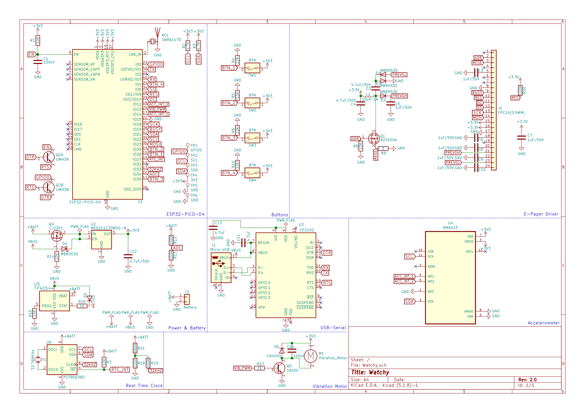

## Schematic

[v3.0](https://github.com/sqfmi/watchy-hardware/blob/v3.0/WatchySchematic.pdf)
[v2.0](https://github.com/sqfmi/watchy-hardware/blob/v2.0/WatchySchematic.pdf)
[v1.5](https://github.com/sqfmi/watchy-hardware/blob/v1.5/WatchySchematic.pdf)
[v1.0](https://github.com/sqfmi/watchy-hardware/blob/v1.0/WatchySchematic.pdf)

---

## Revisions

| Revision         | 3.0                 | 2.0           | 1.5           | 1.0           |
|------------------|---------------------|---------------|---------------|---------------|
| Release Date     | June 2024           | Dec 2021      | Jun 2021      | Nov 2019      |
| SoC              | ESP32-S3FN8         | ESP32-PICO-D4 | ESP32-PICO-D4 | ESP32-PICO-D4 |
| RTC              | EXT 32KHz Crystal   | PCF8536       | PCF8536       | DS3231        |
| USB-Serial       | Built-in CDC/JTAG   | CP2102        | CP2104        | CP2104        |
| USB Device       | CDC, HID, MIDI, MSC | Not Supported | Not Supported | Not Supported |
| Charge Indicator | GPIO10              | LED           | LED           | LED           |
| Bootload/Reset   | Buttons             | DTR/RTS       | DTR/RTS       | DTR/RTS       |

---

## Pin Map

[Pin Mapping in Watchy Library](https://github.com/sqfmi/Watchy/blob/master/src/config.h)

---

## Datasheets

* Microcontroller (v3) [ESP32-S3](https://www.espressif.com/sites/default/files/documentation/esp32-s3_datasheet_en.pdf)
* Microcontroller [ESP32-PICO-D4](https://www.espressif.com/sites/default/files/documentation/esp32-pico-d4_datasheet_en.pdf)
* USB-Serial [CP2104](https://www.silabs.com/documents/public/data-sheets/cp2104.pdf)
* E-Paper Display (v3) [GDEY0154D67](https://www.good-display.com/companyfile/620.html)
* E-Paper Display [GDEH0154D67](https://www.e-paper-display.com/products_detail/productId=455.html)
* Display Connector [AFC07-S24ECC-00](https://datasheet.lcsc.com/szlcsc/1811021340_JUSHUO-AFC07-S24ECC-00_C11092.pdf)
* 3-Axis Accelerometer [BMA423](../static/pdf/BST-BMA423-DS000-1509600.pdf)
* Real Time Clock v1.0 [DS3231](https://datasheets.maximintegrated.com/en/ds/DS3231.pdf)
* Real Time Clock v1.5/2.0 [PCF8563](https://www.mouser.com/datasheet/2/302/PCF8563-1127619.pdf)
* Battery [LiPo Battery 3.7V 200mAh 402030](https://www.powerstream.com/lip/GMB042030.pdf)
* LDO Voltage Regulator [ME6211C33M5G-N](https://datasheet.lcsc.com/szlcsc/Nanjing-Micro-One-Elec-ME6211C33M5G-N_C82942.pdf)
* Battery Connector [BOOMELE 1.25T-2PWT](https://datasheet.lcsc.com/szlcsc/1811092210_BOOMELE-Boom-Precision-Elec-1-25T-2PWT_C22074.pdf)
* Micro USB Connector [U-F-M5DD-Y-L](https://datasheet.lcsc.com/szlcsc/1811131825_Korean-Hroparts-Elec-U-F-M5DD-Y-L_C91146.pdf)
* Tactile Buttons [K2-1114SA-A4SW-06](https://datasheet.lcsc.com/szlcsc/1810061013_Korean-Hroparts-Elec-K2-1114SA-A4SW-06_C136662.pdf)
* Vibration Motor [1020](https://github.com/SeeedDocument/Bazaar_doc/raw/master/316040001/1020_datasheet.doc)
* PCB Antenna [SWRA117D](https://www.ti.com/lit/an/swra117d/swra117d.pdf)

---

## Interactive BOM (v1)

<iframe src="/interactive_bom/watchy_interactive_bom.html" width="100%" height="600" title="Watchy Interactive BOM" ></iframe>

[Open Interactive BOM in new tab](https://watchy.sqfmi.com/interactive_bom/watchy_interactive_bom.html)

[Download BOM CSV](https://github.com/sqfmi/watchy-hardware/blob/main/WatchyBOM.csv)
> Created Using **[InteractiveHtmlBom](https://github.com/openscopeproject/InteractiveHtmlBom)**

---

## KiCAD Design Files & GERBER

* [GitHub](https://github.com/sqfmi/watchy-hardware)

---

## Dimensions

* Length: 46.0MM
* Width: 35.5MM
* Height: 9.5MM
* Weight: 13g

